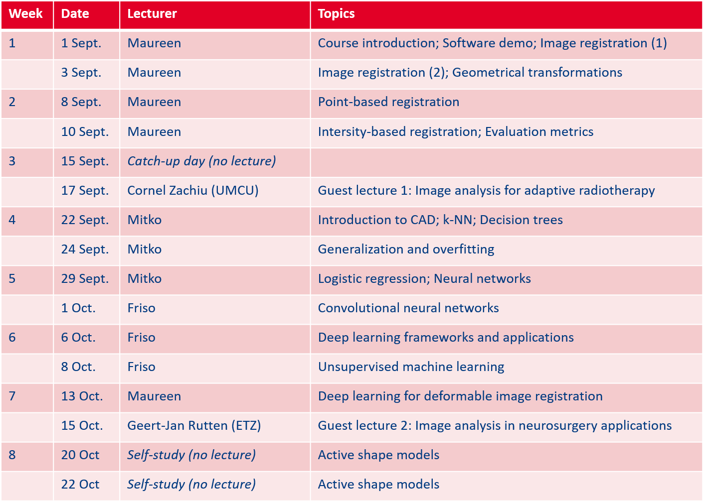

# Medical Image Analysis course (8DC00)

This course is a sequel to the second year introductory imaging course. In that course the basic principles of image analysis were covered. In 8DC00 we will concentrate on the more advanced image analysis methods and on how they can be used to tackle clinical problems. Topics covered include image registration and computer-aided diagnosis (CAD).

## Use of Canvas
This GitHub page contains information about the course and the study material. The [Canvas page of the course](https://canvas.tue.nl/courses/15629) will be used only for sharing course information that cannot be made public (e.g. Microsoft Teams links), submission of the practical work and posting questions to the instructors and teaching assistants (in the Discussion section). Students are highly encouraged to use the Discussion section in Canvas for general questions (e.g., issues with programming environment, methodology questions).

TLDR: GitHub is for content, Canvas for communication and submission of assignments.

## Hybrid schedule due to the coronavirus pandemic

The 2020 edition of the course will be given in a hybrid manner, combining on-campus and online education. We have a limited capacity of 52 student on Tuesdays and 32 students on Thursdays to attend the lectures on-campus. In order to attend the lectures on campus, you have to subscribe for that lecture in Canvas (see instructions in Canvas announcement). All lectures will also be streamed online via Microsoft Teams for the students that want to attend remotely and we aim to record the lectures simultaneously. All practical sessions (guided self-study) will only be online.

The schedule is as follows:

* **Lectures**: Tuesdays 13:30 – 15:30 (location: Atlas 0.820 or via MS Teams) & Thursdays 10:45 – 12:45 (location: Atlas 6.225 or via MS Teams)
* **Guided self-study**: Tuesdays 15:30 - 17:30 & Thursdays 8:45 - 10:45 (via MS Teams)

Since the practical sessions are scheduled immediately before or after the lectures, if you attend the lectures on-campus you might not have sufficient time to travel home for the guided self-study. The University is working on ensuring that there are sufficient number of safe workspaces on-campus so that you can log in from there.

**Lecture schedule:**

## Practical work (exercises and project work)

The practical work will be done in groups. The groups will be formed in Canvas and you will also submit all your work there (check the Assignments section for the deadlines). Your are expected to do this work independently with the help of the teaching assistants during the guided self-study sessions (begeleide zelfstudie). During these sessions, you will be able to join a Microsoft Teams meeting of one of the teaching assistants (each assistant will have a unique link that you can find on Canvas). You can also post your questions in the Discussion section in Canvas at any time.

# Materials

## Books

Primary study materials are the lecture slides and the exercises. In addition, you can study the relevant sections from the following books:

* Fitzpatrick, J.M., Hill, D.L. and Maurer Jr, C.R., [Image registration](http://citeseerx.ist.psu.edu/viewdoc/download?doi=10.1.1.464.5408&rep=rep1&type=pdf).
* Kolter, Z. Do, C., [Linear Algebra Review and Reference](http://cs229.stanford.edu/section/cs229-linalg.pdf)
* Toennies, Klaus D., [Guide to Medical Image Analysis - Methods and Algorithms](https://www.springer.com/gp/book/9781447173182)

## Software

**IMPORTANT: It is essential that you correctly set up the Python working environment by the end of the first week of the course so there are no delays in the work on the practicals.**

To get started, carefully follow the [instructions listed here](software.md).

## Python quiz

**IMPORTANT: Attempting the quiz before the specified deadline is mandatory.**

In the first week of the course you have to do a Python self-assessment quiz in Canvas. The quiz will not be graded. If you fail to complete the quiz before the deadline, you will not get a grade for the course. The goal of the quiz is to give you an idea of the Python programming level that is expected.

If you lack prior knowledge of the Python programming language, you can use the material in the "Python essentials" and "Numerical and scientific computing in Python" modules available [here](https://github.com/tueimage/essential-skills/).

# Lectures, exercises and projects

* [Lecture slides: Course introduction](lectures/1_Course_introduction.pdf)

##  Medical image registration

* Introduction to medical image registration
  * [Lecture slides: Introduction to image registration; Geometrical transformations](lectures/2_Introduction_to_image_registration_Geometrical_transformations.pdf)
  * [Explanation exercises](notebooks/registration_introduction.ipynb)

* Geometrical transformations
  * [Lecture slides: Introduction to image registration; Geometrical transformations](lectures/2_Introduction_to_image_registration_Geometrical_transformations.pdf)
  * [Exercise 1](notebooks/registration_exercise_1.ipynb)

* Image transformation and least squares fitting
  * [Lecture slides: Point-based registration](lectures/3_Point_based_registration.pdf)
  * [Exercise 2](notebooks/registration_exercise_2.ipynb)

* Image similarity metrics
  * [Lecture slides: Intensity-based registration; Image similarity metrics](lectures/4_Intensity_based_registration_Evaluation_metrics.pdf)
  * [Exercise 3](notebooks/registration_exercise_3.ipynb)

* Towards intensity-based image registration
  * [Lecture slides: Intensity-based registration; Image similarity metrics](lectures/4_Intensity_based_registration_Evaluation_metrics.pdf)
  * [Exercise 4](notebooks/registration_exercise_4.ipynb)

* [Project work](notebooks/registration_project.ipynb)

## Computer-aided diagnosis 

* Introduction to computer-aided diagnosis and machine learning
  * Lecture slides
  * [Explanation exercises](notebooks/cad_introduction.ipynb)

* Linear regression, generalization and overfitting
  * Lecture slides
  * [Exercise 1](notebooks/cad_exercise_1.ipynb)

* Logistic regression, neural networks		
  * Lecture slides
  * [Exercise 2](notebooks/cad_exercise_2.ipynb)

* Convolutional neural networks
  * Lecture slides

* Deep learning frameworks and applications		
  * Lecture slides

* Unsupervised machine learning		
  * Lecture slides
  * Optional exercises

* Deep learning for deformable image registration		

## Self-study: Active shape models
In week 8 of the course (19 - 23 October), we will study active shape models. To prepare, you are asked to carefully study the following two papers:

* The original paper by Cootes and Taylor (1995): [Active Shape Models: Their Training and Application](http://dns2.asia.edu.tw/~ysho/YSHO-English/2000%20Engineering/PDF/Com%20Vis%20Ima%20Und61,%2038.pdf).
* A variation on this method by van Ginneken et al. (2002): [Active shape model segmentation with optimal features](https://ieeexplore.ieee.org/abstract/document/1076037)

Make sure to read each paper carefully, look up the terminology that you don't understand, and prepare at least one **exam question** (including correctly formulated answer) on active shape models. You can submit your exam question via the assignment on Canvas. NB: the best exam question will be awarded with 0.5 bonus points on the final exam, and the question itself will be used in the exam.

# Assessment

The assessment will be performed in the following way:
* Project work: 30% of the grade (both projects have equal contribution)
* Final exam: 70% of the grade

Grading of the assignments will be done per group, however, it is possible that individual students get a separate grade from the rest of the group (e.g. if they did not sufficiently participate in the work of the group). More info on the assessment criteria can be found [here](rubric.md).

# Lecturers and teaching assistants
Course instructors:
* Maureen van Eijnatten
* Mitko Veta

Guest lecturers:
* Cornel Zachiu (UMC Utrecht)
* Geert-Jan Rutten (Elisabeth-TweeSteden Ziekenhuis)

Teaching assistants:
* Friso Heslinga (PhD candidate)
* Leander van Eekelen (MSc student)
* Glenn Bouwman (MSc student)
* Stijn Bunk (MSc student)
* Luuk van de Hoek (MSc student)
